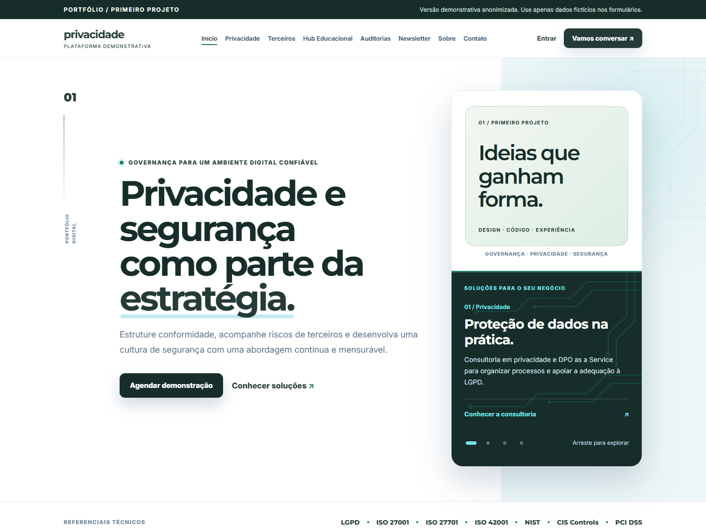

# Plataforma de Privacidade — primeiro projeto

Uma plataforma web com páginas institucionais, avaliação de terceiros, relatórios e áreas autenticadas. Esta é a **versão anonimizada para portfólio do primeiro projeto que conquistamos**, preparada para apresentar o trabalho e compartilhar o código sem divulgar a identidade ou a operação do cliente.

O projeto nasceu de uma necessidade real: organizar serviços de governança, privacidade e segurança em uma experiência clara, responsiva e funcional. A versão pública utiliza uma apresentação neutra, textos demonstrativos e configurações independentes.

> A segunda etapa foi orçada e está aguardando aprovação. O conteúdo deste repositório apresenta a implementação disponível; essa continuidade ainda não é uma entrega aprovada.



## O que você encontra

| Frente | Recursos presentes no código |
| --- | --- |
| Experiência institucional | Página inicial, serviços, sobre, contato, newsletter e documentos legais demonstrativos. |
| Interface | Layout responsivo, menu móvel, carrosséis, FAQs, transições e fontes locais. |
| Avaliação de terceiros | Questionário estruturado, scores orientativos, relatório, plano de ação, CSV e impressão. |
| Evidências | Upload e acesso controlado a PDF, PNG e JPEG, com limites de tamanho. |
| Autenticação | Cadastro com confirmação de e-mail, login, recuperação de senha, sessões e MFA. |
| Área de conta | Histórico de avaliações, configurações de acesso e recursos conforme o perfil. |
| Administração | Gestão de usuários, perfis, solicitações, serviços e visão operacional. |
| Persistência e e-mail | SQLite, caixa local em desenvolvimento, integração SMTP e rotinas de operação. |

Os scores apoiam a leitura das respostas e não representam certificação. As páginas de serviços são conteúdo demonstrativo. As páginas legais precisam ser adaptadas e revisadas para qualquer operação real.

## Tecnologias e escolhas

- **Next.js 16 e React 19:** App Router, componentes de servidor e componentes interativos.
- **JavaScript e CSS:** interface sem dependência de uma biblioteca de componentes; estilos e comportamento ficam explícitos no código.
- **Node.js 24 e SQLite:** persistência local com `node:sqlite`, exigindo armazenamento durável na hospedagem.
- **Nodemailer:** integração de e-mail, com funcionamento local sem credenciais SMTP.
- **otplib e qrcode:** configuração de autenticação em duas etapas.
- **Node Test Runner e Playwright:** testes de regras de negócio, segurança e fluxos de navegador.

Entre os cuidados implementados estão senhas com scrypt e sal, tokens armazenados como hash, cookies de sessão HttpOnly, verificação de origem, limites de tentativas e autorização nas APIs. Esses mecanismos fazem parte da implementação; não substituem uma auditoria de segurança independente.

## Executar localmente

Requisito: **Node.js 24 ou superior** e npm.

```bash
npm ci
npm run dev -- --hostname 127.0.0.1
```

Abra `http://127.0.0.1:3000`. Nenhuma credencial do cliente é necessária.

No Windows, você também pode abrir `Iniciar-Portfolio.cmd` com dois cliques. Mantenha a janela aberta enquanto navega.

A aplicação inicia sem `.env.local`. Para personalizar o ambiente, copie `.env.example` para `.env.local`. Os campos de contato e SMTP vêm vazios. Sem SMTP, as mensagens de desenvolvimento ficam em `.data/outbox`:

```bash
npm run emails:local
```

Use apenas nomes, empresas e endereços fictícios. Os formulários funcionam e podem registrar os dados informados no SQLite local. Não existe administrador com senha padrão: cadastre e confirme uma conta de teste e então conceda o perfil pelo terminal:

```bash
npm run acesso -- pessoa@example.com admin
```

O perfil `cliente` também pode ser atribuído pelo mesmo comando. Nunca conceda acesso por alterações feitas apenas no navegador.

## Validar a implementação

```bash
npm run portfolio:verificar
npm test
npm run build
npm run test:browser
```

Os testes de navegador usam Microsoft Edge por padrão no Windows. Em outro ambiente, instale o Chromium do Playwright e escolha o canal:

Validação desta edição em 06/10/2026: **51 testes de backend e 12 testes de navegador aprovados**, build de produção concluído e verificação do pacote público aprovada. Seis páginas também foram verificadas em desktop e celular, sem overflow horizontal ou erros JavaScript.

```bash
npx playwright install chromium
```

```powershell
$env:PLAYWRIGHT_CHANNEL = 'chromium'
npm run test:browser
```

Em Bash, use `PLAYWRIGHT_CHANNEL=chromium npm run test:browser`.

## Estrutura

```text
app/          Páginas, layouts, estilos e APIs no App Router
components/   Interface, formulários, relatórios e painéis
lib/          Conteúdo, avaliação e serviços de backend
pages/api/    Endpoint de contato
public/       Fontes locais e recurso gráfico genérico
scripts/      Operação local e verificação do pacote público
tests/        Testes automatizados
docs/         Apresentação do projeto e publicação no GitHub/LinkedIn
```

## O que mudou para o portfólio

A cópia pública recebeu uma paleta verde e grafite, assinatura tipográfica genérica, favicon próprio e painel editorial no lugar dos logotipos. A identidade original, canais de contato, domínio, referências internas à marca e configurações privadas não foram transportados. O banner de demonstração identifica a finalidade desta versão em todas as páginas.

O pacote inclui apenas o código selecionado e os arquivos públicos necessários. Não contém histórico Git do cliente, banco de dados, contas, anexos, mensagens locais, backups, arquivos de ambiente privados ou automações específicas da hospedagem contratada. O backend desta versão é Node.js; os recursos da publicação PHP do cliente ficam fora deste repositório.

## Primeiro projeto: contexto e aprendizado

Conquistar o primeiro projeto foi o ponto de partida para transformar conhecimento técnico em uma solução para uma necessidade real. O desafio envolveu mais do que a página inicial: organizar conteúdo, definir navegação, construir formulários, separar permissões e conectar a interface à persistência.

O resultado é uma base que permite apresentar decisões de design e engenharia de maneira concreta. O aprendizado passa pela definição de escopo, atenção aos detalhes, validação de fluxos e cuidado com os dados do cliente. Não há métricas de negócio, certificações ou resultados comerciais atribuídos a esta demonstração.

Veja o [estudo de caso](docs/ESTUDO-DE-CASO.md), o [texto para LinkedIn](docs/LINKEDIN.md) e o [guia para publicar](docs/PUBLICAR.md).

## Hospedagem e uso do código

Para executar em produção, use `npm run build` e `npm start` em um servidor Node com disco persistente. O SQLite e os arquivos operacionais precisam de armazenamento privado durável. Uma exportação estática não executa as APIs, e um disco temporário não conserva os registros.

Esta cópia foi preparada para apresentação pública. Uma operação real exige configuração própria de HTTPS, SMTP, backups, chaves e identidade legal. Nenhuma licença de redistribuição foi escolhida automaticamente; antes de autorizar reutilização por terceiros, defina a licença compatível com os direitos sobre o código. As fontes preservam seus arquivos de licença em `public/fonts/`.
